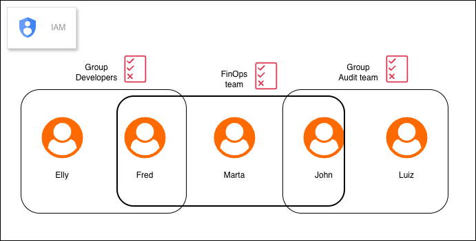

# AWS Identity And Access Management (IAM)


It is an AWS service that allows you to control who can access services and set permission levels for users and services

## Things you can do with IAM
- Users
- Roles
- Groups
- Policies
- Security Tools

## Users and Groups
Groups are used to manage permissions for different users; users can belong to multiple groups, which makes management easier.
It is not recommended to assign policies to individual users; best practice is to assign them to groups.




## Policies
Policies are Json document that specify what you can and cannot do, for example the group developers has the policie `getListUser` assign so Anyone in the developers group can list the users. You can define user, groups or roles permissions

If you have two policies—one that allows a service and another that denies a service—the one that takes precedence is the one that denies it.

See below for an example

Policie `IAMReadOnlyAccess` -> users only can see, editing is not allowed

```json
{
    "Version": "2012-10-17",
    "id": 1,
    "Statement": [
        {
            "Effect": "Allow",
            "Action": [
                "iam:GenerateCredentialReport",
                "iam:GenerateServiceLastAccessedDetails",
                "iam:Get*",
                "iam:List*",
                "iam:SimulateCustomPolicy",
                "iam:SimulatePrincipalPolicy"
            ],
            "Resource": "*"
        }
    ]
}
```

#### Structure for Policies

- `version`: Policy language version
- `id`: id for policy(its opcional)
- `statement`: details
- `effect`: permission for the service, can be allow/denied
- `principal`: list of accounts allowed
- `action`: which actions user is allowed to do
- `Resource`: which services user is allowed to do
- `condition`: You can define a condition to run the rules

#### You can create your own Policy
- Its possible to create using json editor or visual

see example below
```json
{
	"Version": "2012-10-17",
	"Statement": [
		{
			"Sid": "VisualEditor0",
			"Effect": "Allow",
			"Action": [
				"s3:ListAccessPoints",
				"s3:ListJobs",
				"s3:ListBucket",
				"iam:GetAccountSummary"
			],
			"Resource": "*"
		}
	]
}
```

## Roles
It's similar to policies, but for services. For example, if I want to grant the EC2 service permission to only read files from the S3 bucket, in that case you create a role
If you compare with policies, the difference in the structure will be in the `principal` field

```json
{
    "Version": "2012-10-17",
    "Statement": [
        {
            "Effect": "Allow",
            "Action": [
                "sts:AssumeRole"
            ],
            "Principal": {
                "Service": [
                    "lambda.amazonaws.com"
                ]
            }
        }
    ]
}
```

## IAM Security Tools
- Access advisor(user level)
  - services accessed by the user and the last time they were accessed
- Credential reports(account level)
  - List status, list all accounts 

## Best Practices
- One physical user per one user aws
- Create strong policy password
- use and enforce user to use MFA
- Create and use role to give permissions to services
- use access key when you use cli or sdk
- never share iam users

